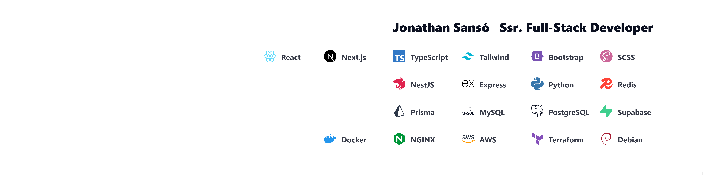

<p align="center">
  
</p>

<h3 align="center">Full-Stack Developer | AI Engineering (Gemini LLM, OCR/NLP/STT) | Multi-tenant SaaS (Supabase/Postgres RLS)</h3>
<p align="center">Buenos Aires, Argentina · Remote · English B2</p>

---

### What I do
**4+ years** building **multi-tenant SaaS products** end-to-end — from tenant-isolated backends with **Supabase RLS/Policies** to polished frontends with **Next.js + TypeScript + Tailwind**.  
I also build **AI document intelligence pipelines** (Tesseract OCR, NLP, Speech-to-Text), **LLM-powered features** (Google Gemini API with 3-model cascade fallback for HA), and deploy with **Docker, NGINX, AWS, and Terraform**. Mercado Pago integration.

---

### Core Stack
| Layer | Technologies |
|---|---|
| **Frontend** | Next.js, React, TypeScript, Tailwind, Zustand, TanStack Query, Zod, ShadCN UI |
| **Backend** | NestJS, Node.js, Prisma, FastAPI (Python), Express, GraphQL |
| **Databases** | PostgreSQL (Supabase RLS, Triggers, RPC), MySQL, MongoDB, SQL Server, Redis |
| **DevOps** | Docker, NGINX, AWS (EC2, RDS, S3, CloudFront), Terraform, Vercel, Git/GitHub |
| **AI & Data** | Gemini API (LLM cascade), Tesseract OCR, NLP, Speech-to-Text, Pandas, jsPDF, ExcelJS |
| **Security** | Auth0, MFA/2FA, CSRF, Helmet/CORS, HMAC-SHA256, JWT, Rate Limiting |

---

### Experience

**Ocean Stack** — Full-Stack Developer (Multi-tenant SaaS) · Dec 2025 – Jun 2026  
_Products: [Niappa POS](https://niappa-restaurant.vercel.app/) | [Oceans HR (ATS)](https://oceans-hr.vercel.app/)_  
- Multi-tenant isolation with **Supabase Postgres RLS/Policies** and RBAC across modules.  
- Orders at scale: table sessions, split checks, resilient order lifecycle with transactional integrity.  
- Built **Oceans HR ATS**: Kanban pipeline, drag-and-drop, recruitment funnel reports (Next.js 16, React 19, TanStack Query v5, @dnd-kit).  
- Engineered **AI-Powered CV Matching Engine**: LLM integration (Gemini API with 3-model cascade fallback for HA), PDF text extraction, weighted scoring across 8 criteria (skills, seniority, role, education, location, salary, language, industry), structured JSON output, drag-and-drop upload, color-coded score cards, per-criteria progress bars, and automated candidate creation pipeline.  
- Mercado Pago API integration, PDF/Excel reporting, full ES/EN i18n.

**Argentine Federal Penitentiary Service** — Full-Stack Developer / AI Engineering · Jan 2024 – Present  
- Led a **national-scale two-platform ecosystem** (internal ops + public verification portal).  
- Built **AI document intelligence pipeline**: OCR + NLP + STT with human-in-the-loop review (Python, FastAPI).  
- End-to-end security: MFA, CSRF, HMAC-SHA256, JWT, cryptographic document verification.  
- Containerized deployments with **Docker + NGINX on Debian**, automated backups, Redis job queues (BullMQ).

**VirtuaState** — Frontend Developer · May 2022 – Dec 2023  
- Responsive marketing site for a VR/AR studio with SEO optimizations. [virtuastate.net](https://www.virtuastate.net/)

---

### Live Projects & Links
| | |
|---|---|
| **Portfolio** | [portfolio-sanso-jonathan.netlify.app](https://portfolio-sanso-jonathan.netlify.app/) |
| **Niappa POS** | [niappa-restaurant.vercel.app](https://niappa-restaurant.vercel.app/) |
| **Oceans HR** | [oceans-hr.vercel.app](https://oceans-hr.vercel.app/) |
| **VirtuaState** | [virtuastate.net](https://www.virtuastate.net/) |
| **E-Commerce React** | [react-e-commerce-j-sanso.vercel.app](https://react-e-commerce-j-sanso.vercel.app/) |
| **LinkedIn** | [jonathan-sanso-fullstack](https://www.linkedin.com/in/jonathan-sanso-fullstack/) |
| **GitHub** | [jonathansansok](https://github.com/jonathansansok) |

---

### Contact
- **Email:** jonasans2@live.com.ar  
- **WhatsApp:** [+54 9 11 6912-3268](https://wa.me/5491169123268)  
- **LinkedIn:** [jonathan-sanso-fullstack](https://www.linkedin.com/in/jonathan-sanso-fullstack)

---

```ts
const jonathanSanso = {
  role: "Ssr. Full-Stack Developer",
  english: "B2",
  focus: ["Multi-tenant SaaS", "Security-first architecture", "AI in production", "Product-minded delivery"],
  stack: {
    frontend: ["Next.js", "React", "TypeScript", "Tailwind", "Zustand", "TanStack Query", "ShadCN UI"],
    backend: ["NestJS", "Node.js", "Prisma", "FastAPI", "Express", "GraphQL"],
    databases: ["PostgreSQL (Supabase RLS)", "MySQL", "MongoDB", "Redis", "SQL Server"],
    ai_data: ["Gemini API (LLM cascade)", "Tesseract OCR", "NLP", "Speech-to-Text", "Pandas", "jsPDF", "ExcelJS"],
    infra: ["Docker", "NGINX", "AWS", "Terraform", "Debian Linux", "Vercel"],
    security: ["Auth0", "MFA/2FA", "CSRF", "HMAC-SHA256", "JWT", "Rate Limiting"],
  },
} as const;
```

---

<p align="center"><a href="https://reactjs.org/"></a> <a href="https://nextjs.org/"></a> <a href="https://www.typescriptlang.org/"></a> <a href="https://tailwindcss.com/"></a> <a href="https://nestjs.com/"></a> <a href="https://expressjs.com/"></a> <a href="https://www.prisma.io/"></a> <a href="https://www.mysql.com/"></a> <a href="https://www.postgresql.org/"></a> <a href="https://www.mongodb.com/"></a> <a href="https://www.docker.com/"></a> <a href="https://redis.io/"></a> <a href="https://www.python.org/"></a> <a href="https://aws.amazon.com/"></a> <a href="https://www.nginx.com/"></a></p>

<p align="center"><a href="https://github.com/jonathansansok"></a> <a href="https://github.com/jonathansansok?tab=repositories"></a> <a href="https://github.com/jonathansansok"></a></p>

<p align="center"><a href="https://github.com/jonathansansok"></a></p>

<p align="center"><a href="https://github.com/jonathansansok"></a></p>
